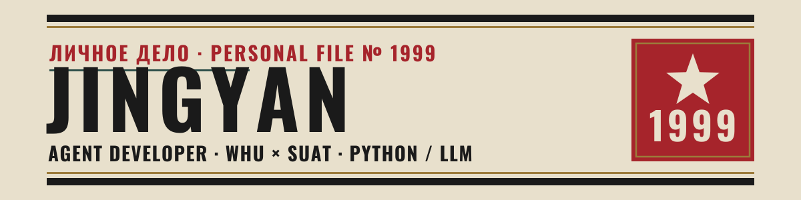
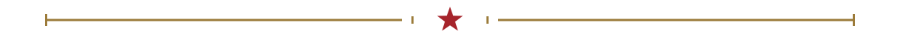
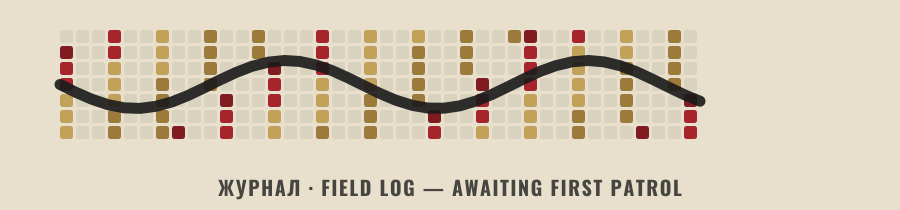

<!--
  ════════════════════════════════════════════════════════════════════
  PERSONAL FILE № 1999  ·  constructivist × Reverse:1999 profile
  Placeholders to replace before/at go-live are marked  ⟨LIKE THIS⟩.
  Assets live in /assets (main branch); the snake is generated to the
  /output branch by .github/workflows/snake.yml after Actions is enabled.
  ════════════════════════════════════════════════════════════════════
-->

<div align="center">
  <picture>
    <source media="(prefers-color-scheme: dark)" srcset="./assets/banner-dark.svg">
    
  </picture>
</div>

<div align="center">
  
</div>

## ★&nbsp; СВОДКА · ABOUT

**Python developer — into LLM agents and small automations.** Student at **WHU × SUAT**.
Build-first and curious; I learn by making things (and breaking them). 喜欢边做边学，做坏了再修，慢慢升级。

|  |  |
|:--|:--|
| **SPECIALTY · 专长** | Python · LLM / agent systems |
| **AFFILIATION · 所属** | Wuhan University × SUAT |
| **CODENAME · 代号** | `JingyanCCCP` — да, как СССР |
| **STATUS · 状态** | в процессе · still leveling up |

<div align="center"></div>

## ★&nbsp; ПЯТИЛЕТКА · FIVE-YEAR PLAN

> 重成长，不重现在 — measured by what I'm leveling up, not what's already shipped.

```text
Python              ███████████████░░░░░   building fluency
LLM / agents        ████████████░░░░░░░░   in progress
Systems / backend   ████████░░░░░░░░░░░░   researching
English / writing   ██████████████░░░░░░   ongoing
```

<div align="center"></div>

## ★&nbsp; ПРОЕКТЫ · PROJECTS

**[UniLife-OS](https://github.com/JingyanCCCP/UniLife-OS)** &nbsp;·&nbsp; `Python` &nbsp;·&nbsp; a university-life assistant agent &nbsp;·&nbsp; ★ 3
<!-- add future projects here as plain one-liners -->


<div align="center"></div>

## ★&nbsp; ЖУРНАЛ · FIELD LOG

<!-- GO-LIVE: once Actions is enabled and the snake is generated to the output branch,
     replace the placeholder <picture> below with the live snake:
<picture>
  <source media="(prefers-color-scheme: dark)" srcset="https://raw.githubusercontent.com/JingyanCCCP/JingyanCCCP/output/snake-dark.svg">
  
</picture>
-->
<div align="center">
  <picture>
    <source media="(prefers-color-scheme: dark)" srcset="./assets/snake-placeholder-dark.svg">
    
  </picture>
  <br>
  <sub><i>contributions, eaten on patrol · 贡献时间线（启用 Actions 后由工作流生成动图）</i></sub>
</div>

<div align="center"></div>

## ★&nbsp; СВЯЗЬ · CHANNELS

<p align="center">
  <a href="mailto:⟨YOUR-EMAIL⟩"></a>&nbsp;
  <a href="https://github.com/JingyanCCCP"></a>&nbsp;
  <a href="https://x.com/⟨YOUR-ID⟩"></a>&nbsp;
  <a href="https://www.zhihu.com/people/⟨YOUR-ID⟩"></a>&nbsp;
  <a href="https://space.bilibili.com/⟨YOUR-UID⟩"></a>
</p>

<div align="center"></div>

<div align="center">
  <sub><i>« Time is a storm. Keep the records. »&nbsp; ·&nbsp; 时间是一场风暴，记录留存。</i></sub>
</div>
